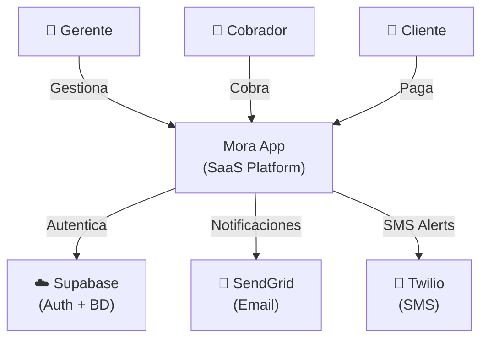
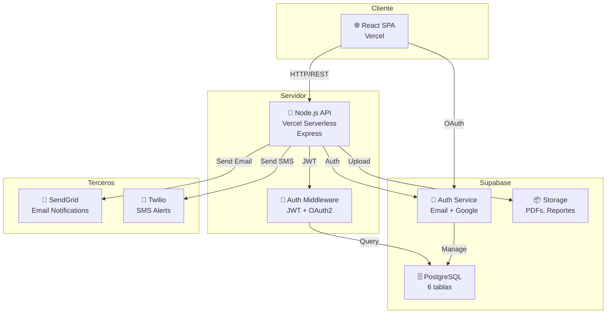
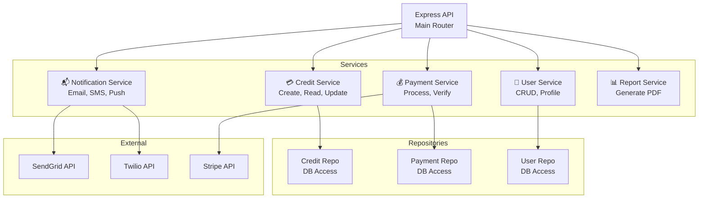

# 🏗️ Arquitectura Mora App

**Mora App** es una plataforma SaaS para gestión integral de créditos, cobranzas y seguimiento de deudores.

## 📊 Level 1: System Context



**Actores:**
- **Gerente**: Crea créditos, genera reportes, gestiona cobradores
- **Cobrador**: Rastrea deudas, registra pagos, envia recordatorios
- **Cliente**: Ve deuda, paga online, recibe notificaciones
- **Supabase**: Auth, BD, Storage (PDFs)
- **SendGrid**: Notificaciones por email
- **Twilio**: SMS de recordatorios

---

## 🎯 Level 2: Container Architecture



### Componentes Detallados

#### 1. **React Frontend** (Vercel)
- **Stack**: React 18, TypeScript, Tailwind CSS, Zustand
- **Características**:
  - SPA responsivo (mobile-first)
  - Autenticación con OAuth2
  - Dashboard en tiempo real
  - Gráficos de deudas
  - Generador de PDFs
- **Conexión**: REST API + Supabase Auth Client

#### 2. **Node.js Backend** (Vercel Functions)
- **Stack**: Express.js, TypeScript, Supabase Admin SDK
- **Responsabilidades**:
  - Gestión de créditos
  - Procesamiento de pagos
  - Validación de datos
  - Envío de notificaciones
  - Generación de reportes
- **Auth**: Middleware JWT + Supabase

#### 3. **Supabase**
- **Auth**: Email + OAuth2 (Google, GitHub)
- **BD**: PostgreSQL con 6 tablas
- **Storage**: PDFs de reportes y documentos
- **RLS**: Row-Level Security por usuario

#### 4. **SendGrid**
- Notificaciones por email
- Recordatorios de pago
- Reportes automáticos

#### 5. **Twilio**
- SMS de recordatorios
- Confirmación de pagos

---

## 🔀 Level 3: Microservicios Backend



### Servicios Principales

| Servicio | Responsabilidad |
|----------|-----------------|
| **CreditService** | Crear, actualizar, listar créditos |
| **PaymentService** | Procesar pagos, validar, registrar |
| **UserService** | Gestión de usuarios, roles |
| **NotificationService** | Email, SMS, push notifications |
| **ReportService** | Generar PDFs, análisis, exportar |

---

## 📈 Flujos de Datos Principales

### Flujo 1: Crear Crédito
```
Gerente → React UI
    ↓
POST /api/credits
    ↓
CreditService.create()
    ↓
CreditRepository.insert()
    ↓
PostgreSQL (INSERT)
    ↓
Response: { id, amount, customer }
```

### Flujo 2: Registrar Pago
```
Cliente/Cobrador → React UI
    ↓
POST /api/payments
    ↓
PaymentService.process()
    ↓
Stripe.charge()  ← Pago online
    ↓
PaymentRepository.insert()
    ↓
UPDATE crédito (saldo)
    ↓
NotificationService.send()
    ↓
SendGrid: Email confirmación
Twilio: SMS comprobante
```

### Flujo 3: Generar Reporte
```
Gerente → Request reporte
    ↓
GET /api/reports/:id
    ↓
ReportService.generate()
    ↓
Query: Datos de BD
    ↓
PDF Generation
    ↓
Supabase Storage: Upload
    ↓
Response: URL descargable
```

---

## 🔐 Patrones de Seguridad

### Authentication
- OAuth2 con Supabase (Email + Google)
- JWT en cookies HttpOnly
- Refresh token rotation

### Authorization
- Role-based (Gerente, Cobrador, Cliente)
- Row-Level Security en BD
- Middleware de permisos en API

### Data Protection
- Encriptación en tránsito (HTTPS)
- Datos sensibles encriptados en BD
- CORS configurado
- Rate limiting

---

## 📊 Stack Tecnológico

| Capa | Tecnología | Razón |
|------|-----------|-------|
| **Frontend** | React 18 + TypeScript | SPA moderna, type-safe |
| **Estilos** | Tailwind CSS | Utility-first, responsive |
| **Backend** | Node.js + Express | Serverless, escalable |
| **BD** | PostgreSQL (Supabase) | ACID, relaciones, RLS |
| **Auth** | Supabase Auth | OAuth2, email verification |
| **Storage** | Supabase Storage | PDFs, documentos |
| **Email** | SendGrid | Confiable, escalable |
| **SMS** | Twilio | Recordatorios, alertas |
| **Pagos** | Stripe | PCI compliant, seguro |
| **Hosting** | Vercel | Serverless, auto-scaling |
| **CI/CD** | GitHub Actions | Automático, gratis |

---

## 🚀 Escalabilidad

### Horizontal
- Vercel Functions: Auto-scale
- Supabase: Multi-region replication
- SendGrid/Twilio: SaaS (sin preocupación)

### Vertical
- PostgreSQL: Índices, partitioning
- Redis (futuro): Caching
- CDN: Imágenes, PDFs

### Performance
- API response: <200ms
- Frontend: Lazy loading
- Reportes: Generación async en background

---

## 🔄 Despliegue

**Frontend**: Vercel (auto-deploy en push a main)
**Backend**: Vercel Functions (serverless)
**BD**: Supabase Cloud
**Notificaciones**: SendGrid + Twilio (configurados)

---

**Diagramas y decisiones detalladas en:**
- `docs/adr/ADR-001-supabase.md`
- `docs/adr/ADR-002-auth.md`
