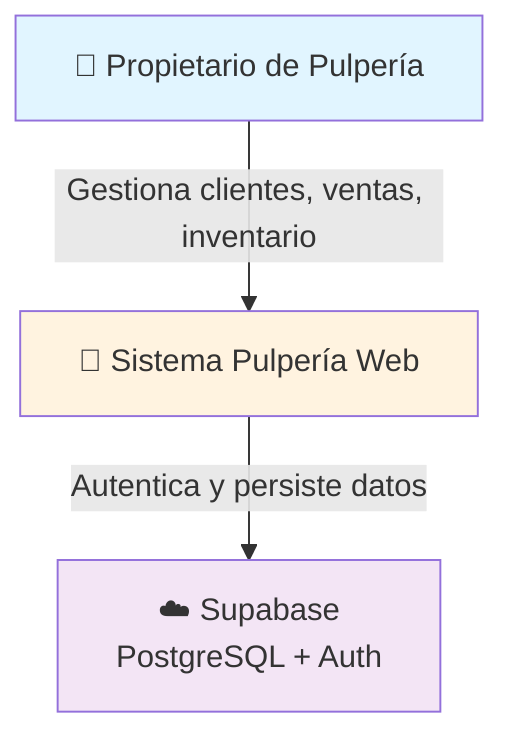
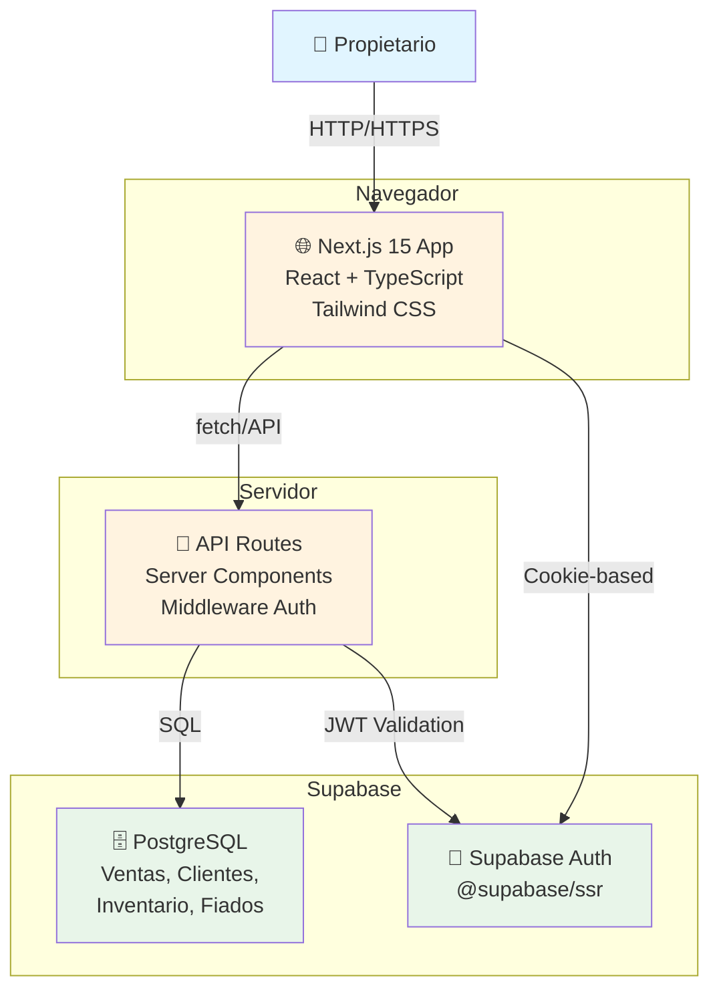
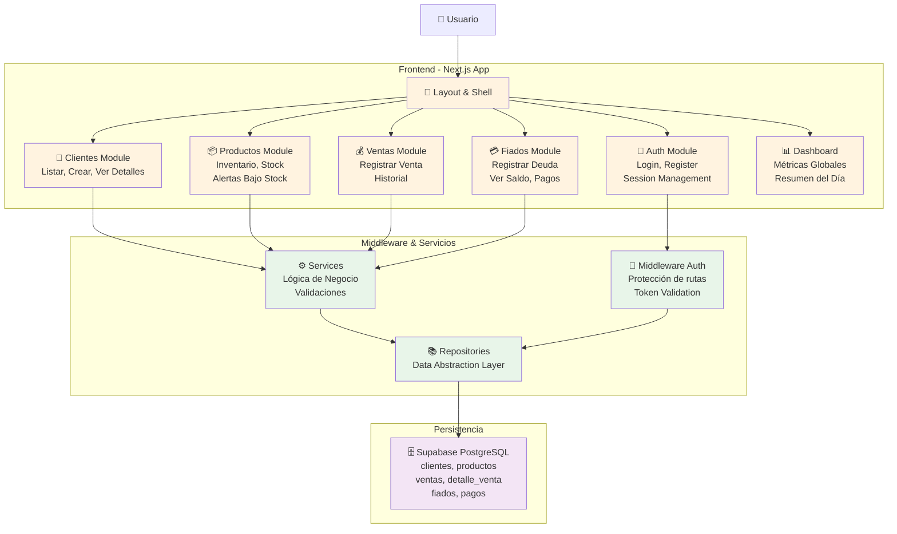

# Arquitectura de Sistema - Pulpería Web

## Visión General

Pulpería es una plataforma web para la gestión integral de pequeñas tiendas de barrio (pulperías). Permite a propietarios gestionar clientes, inventario, ventas y deudas (fiados) desde una interfaz web moderna y responsiva.

## Diagramas C4

### Level 1: System Context



### Level 2: Container



### Level 3: Components (Arquitectura Feature-Based)



## Estructura de Directorios

```
src/
├── app/                      # Next.js 15 App Router
│   ├── (auth)/              # Rutas públicas (login, register)
│   │   ├── login/page.tsx
│   │   └── register/page.tsx
│   ├── (dashboard)/         # Rutas protegidas
│   │   ├── layout.tsx
│   │   ├── page.tsx         # Dashboard
│   │   ├── clientes/
│   │   ├── productos/
│   │   ├── ventas/
│   │   └── fiados/
│   ├── api/                 # API Routes
│   │   ├── auth/
│   │   ├── clientes/
│   │   ├── productos/
│   │   ├── ventas/
│   │   └── fiados/
│   └── middleware.ts        # Auth middleware
├── modules/                 # Lógica de negocio por dominio
│   ├── auth/
│   │   ├── services/
│   │   └── types/
│   ├── clientes/
│   │   ├── services/
│   │   ├── repositories/
│   │   └── types/
│   ├── productos/
│   │   ├── services/
│   │   ├── repositories/
│   │   └── types/
│   ├── ventas/
│   │   ├── services/
│   │   ├── repositories/
│   │   └── types/
│   └── fiados/
│       ├── services/
│       ├── repositories/
│       └── types/
├── components/              # Componentes UI reutilizables
│   ├── layout/
│   ├── form/
│   └── common/
├── lib/                     # Utilidades y helpers
│   ├── supabase/
│   ├── auth/
│   └── utils/
├── types/                   # Tipos TypeScript globales
└── styles/                  # Tailwind CSS config
```

## Flujos de Datos Principales

### Flujo de Autenticación

```
Login Form
    ↓
POST /api/auth/login
    ↓
Supabase Auth (signInWithPassword)
    ↓
Cookie almacenada (httpOnly)
    ↓
Middleware valida token
    ↓
Acceso a Dashboard
```

### Flujo de Registro de Venta

```
Formulario Venta
    ↓
Services/VentasService.createVenta()
    ↓
Repositories/VentasRepository
    ↓
INSERT ventas + INSERT detalle_venta
    ↓
Trigger: descuenta stock en productos
    ↓
Respuesta con ID venta
    ↓
Update UI + Toast confirmación
```

### Flujo de Fiados y Pagos

```
Registrar Fiado
    ↓
Services/FiadosService.createFiado()
    ↓
INSERT fiados (saldo_pendiente = monto_total)
    ↓
    ├─ Ver Saldo del Cliente
    │   └─ SUM(saldo_pendiente) de todos sus fiados
    │
    └─ Registrar Pago
        ↓
        Services/PagosService.createPago()
        ↓
        INSERT pagos + UPDATE fiados.saldo_pendiente
        ↓
        Trigger actualiza estado fiado
```

## Patrones y Principios

### Dependency Inversion Principle (DIP)

Las capas superiores no dependen de implementación específica de persistencia:

```
UI → Services → Repositories → Supabase
```

Los repositories exponen interfaces genéricas; la BD es intercambiable.

### Context API + React Hooks

- Estado global de autenticación en `AuthContext`
- Estados locales en componentes con `useState`
- Custom hooks para operaciones recurrentes (ej: `useClientes`)

### Server Components vs Client Components

- **Server Components**: Páginas que renderiza Next.js (dashboards, listados)
- **Client Components**: Formularios interactivos, estado UI (`'use client'`)

### Seguridad

- **CORS**: Configurado solo para dominio propio
- **JWT**: Validado en middleware antes de acceder a rutas protegidas
- **SQL Injection**: Previene con parámetros preparados (Supabase client)
- **CSRF**: Next.js maneja automáticamente en API routes

## Stack Tecnológico

| Componente | Tecnología | Razón |
|-----------|-----------|-------|
| **Frontend** | Next.js 15 | SSR, App Router, performance |
| **UI** | React 19 | Componentes, hooks |
| **Estilos** | Tailwind CSS | Desarrollo rápido, responsive |
| **Tipo de datos** | TypeScript | Type-safety, mantenibilidad |
| **Base de datos** | PostgreSQL (Supabase) | ACID, relaciones, escalabilidad |
| **Autenticación** | Supabase Auth + @supabase/ssr | Segura, SSR-friendly |
| **Hosting** | Vercel | Optimizado para Next.js, CD automático |

## Decisiones Arquitectónicas

Ver documentos de Decisiones de Arquitectura (ADR) para justificación detallada:
- [[ADR-001-persistencia.md]] - PostgreSQL en Supabase
- [[ADR-002-auth.md]] - Supabase Auth + @supabase/ssr
